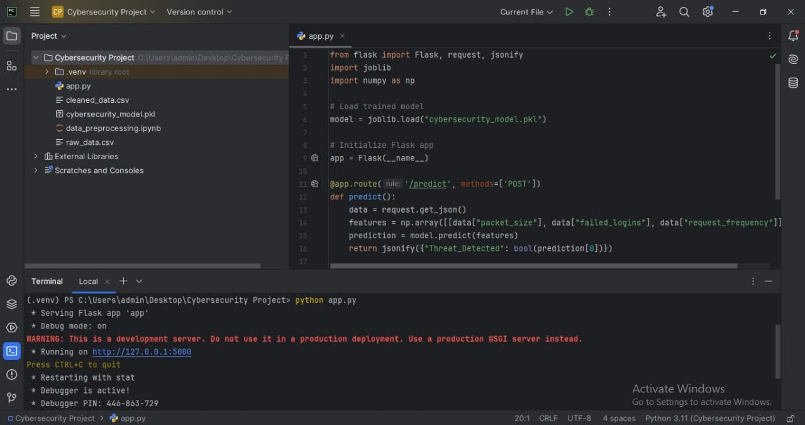

## AI-Powered Cybersecurity Threat Detection

## Description -
This project is an AI-powered cybersecurity threat detection system that analyzes failed logins, packet sizes, and request frequency to identify potential threats.

## Installation -
a) Using Google Colab:
1. Open Google Colab.
2. Upload the project files to your Google Drive.
3. Open the `.ipynb` notebook and run the cells.
   
b) Using PyCharm:
1. Clone this repository or download the ZIP file.
2. Open the project in PyCharm.
3. Create a virtual environment and install dependencies using:
   ```sh
   pip install -r requirements.txt
   ```
## Usage -
1. Preprocess the data using `data_preprocessing.ipynb`.
2. Train the model using `app.py`.
3. Evaluate and analyze the threat detection results.
   
## Features -
1) AI-based threat detection.
2) Analyzes failed logins and network requests.
3) Supports data preprocessing and model training.

## Project_Images  

### Flask Server Running  
  

### Testing with Postman  
  


## Folder Structure -
```
Cybersecurity Project/
│── App/
│   ├── app.py
│── Data/
│   ├── raw_data.csv
│   ├── cleaned_data.csv
│── Model/
│   ├── cybersecurity_model.pkl
│── Project_Images/
│   ├── API_running_in_Flask.jpg
│   ├── API_tested_in_Postman.jpg
│── .gitignore
│── README.md
│── data_preprocessing.ipynb
```
## Contributors -
Developed by: Rahul Bhoyar

## Copyright Notice -
This project is for portfolio purposes only. Unauthorized use, modification, or distribution is not allowed. 
